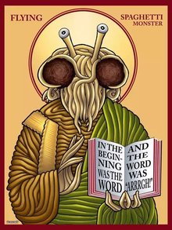
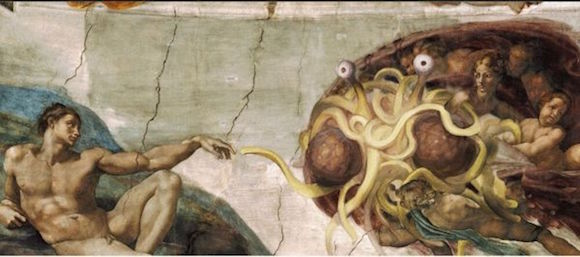

# <h1>0002.飞天面条神教</h1>
飞天面条神教，又译“飞天意面神教”“飞天拉面神教”“飞面神教”“飞行面条怪物信仰”（拉丁语：Pastafarianism，英语：Flying Spaghetti Monsterism，简称FSM）。
它起源于美国，由美国俄勒冈州立大学物理学士毕业生博比·亨德森（Bobby Henderson）于2005年6月创立。
这些人相信宇宙是由一个会飞行的意大利面条怪物在 “一次严重的酗酒后” 创造的，而这个意大利面条怪就是唯一的真神，所以又被称为 “飞面大神”。
这是一种讽刺性的虚拟宗教，主要针对某些宗教教派所宣称的智能设计论（生物并非出于进化，而是源自某种超自然智能的设计）。他们从一部分上认可进化论。
截至2016年2月，“飞天面条神教”已在丹麦、新西兰获得许可，荷兰政府则将“飞天面条神教”认定为合法宗教。

中文名      飞天面条神教

外文名      Flying Spaghetti Monsterism/Pastafarianism/FSM

会员数      未得到准确统计

合法性      2016年2月3日荷兰批准合法

<h2>概念起源</h2>

“飞行面条怪”（Flying Spaghetti Monster）其核心概念源自博比·亨德森在2005年1月撰写的公开信，其目的在于反对美国堪萨斯州教育委员会所通过的一项决议，该决议允许智能设计论和进化论一道作为该校的科学课程，并具有等同的学分。智能设计论者“立论小心地使用世俗的词汇，并刻意避免指出设计者的身份”，以规避美国法律对学校不得将神创论作为“科学知识”传授的禁令。亨德森针对“智能设计者身份不明”这一方面，以子之矛攻子之盾，宣称创世者是一个飞行的面条怪物。

在公开信中，他要求飞行面条怪物信仰的创世学说也成为自然科学课的正式教学内容。他在公开信中说：

<i>1.我认为我们应该团结一致，为三种理论在全国，乃至全球的自然科学课上取得相同课时而奋斗：三分之一的时间给智能设计论，三分之一给飞行面条怪物信仰，余下的时间给那个符合逻辑而有着压倒性物证的推测学说（指进化论）。</i>

<i>2.我并不反对宗教。但是我反对把宗教装扮成科学。如果有个上帝，而且他足够聪明，那么我认为他应该具备幽默感（意为上帝也能理解亨德森的行为）。</i>

堪州教委起初并没有对公开信做出反应，亨德森于是在他的个人网站上公布了公开信的内容，这件事立刻在网上引起关注。亨氏的犀利的反讽引来了众多支持者，他们纷纷在亨氏的网站上以各种形式的反馈（如留言、发表相关艺术品、PS过的可以“证明”飞行面条怪存在的照片等）表示支持。很多部落客也纷纷关注这个事件。在亨德森获得了广泛的舆论关注后，堪萨斯州教委才对信件做出了回复。亨氏随后又发表了对回信的回复。随着支持者人数激增，亨德森开始在网站上出售与其新创立的“宗教”相关的商品，如恤衫、茶杯等。他推论说，因为美国总统乔治·布什和参议员比尔·福利斯特已经公开支持教授非进化论学说，因此他们也支持教授飞行面条怪物信仰。

飞行面条怪物信仰立刻登上诸如Boing Boing、Something Awful、伪基百科之类的恶搞网站的头条。很多“教徒”也纷纷成立网站表示支持。此类网站如FSMAwareness更激发了公众的兴趣。当飞行面条怪物信仰逐渐成为反对智能设计论的新标志时，主流媒体也意识到了它的意义，开始关注此事。《纽约时报》等更进行了大幅报道。亨德森本人也惊异于他的“新宗教”的威力，说他最初写信的目的也不过是“为了自娱自乐”。

2005年8月，一家支持神创论的网站设立了25万美元奖金，给任何能证明进化是宇宙和生物诞生的“唯一途径”的人。为了讽刺这家网站，Boing Boing网宣布悬赏25万美元给任何能以经验主义证明耶稣不是飞行面条怪的儿子的人。奖金随后追加到了100万美元。

2005年11月，堪萨斯州教育委员会投票通过决议，允许“对进化论的各类反对意见（包括智能设计论）”列入考试标准。

2007年2月13日，堪州教委以6票对4票，否决了以上决议。这也是8年来，该州教委第五次修改关于进化论的考试标准。

2015年12月，“飞天面条神教”在丹麦获得许可，注册成立分会。

2015年12月15日，曾有报道称，新西兰政府向“飞天面条神教”教堂颁发了许可证，允许该教在国内主持异性或同性婚礼。随后新西兰官媒《新西兰公报》网站10日公布了这一许可。

2016年2月，荷兰政府将“飞天面条神教”认定为合法宗教。

<h2>中心教义</h2>

1.飞天面条神教的中心教义认为，一个不可见，且不可感知的“飞行着的意大利面条怪物”在“一次严重的酗酒后”，创造了整个宇宙。

2.飞天面条神教的天堂中有一座喷发啤酒的火山和一座脱衣舞场。地狱类似天堂，不同处在于火山喷出的是马尿而非啤酒，更糟的是，脱衣舞娘都身患性病。

3.据推测，正是酒精中毒导致飞行面条神创造的地球充满种种瑕疵。所有支持进化论的证据都是面条神布置的。他通过让事物显得更古老，测试教徒的虔诚。当科学家采用放射测年法等科学方法，以试图确定事物年龄时，飞天面条神会通过“他面条般神圣的附肢来改变测量结果”，以使结果显得更古老。

4.创世时，飞天面条神首先创造了山、树木以及一个“小矮人”；

5.全球变暖、地震、飓风以及其他自然灾害，都是19世纪以后，全球海盗数量的减少直接造成的；

6.每个星期五为圣日，也是休息日，教徒可以此为依据向雇主要求在该日休息。

7.信徒应遵守馍西八诫，也就是避免去做八件“飞天面条神真心希望你不要去做”的事情。

<h2>信仰体系</h2>
<h3>海盗</h3>

在飞天面条神教的信仰体系中，海盗是“绝对神性的体现者”，也是最早皈依飞天面条神的教徒。他们“强盗和流氓”的负面形象，其实是由中世纪基督教神学家和印度教奎师那派联手歪曲散布的。

面条神教认为，真正的海盗是“热爱和平的探险家和正义的使者”：他们会向儿童分发糖果。至于现代海盗，则和他们“历史上热衷找乐儿的海贼”祖先毫无共同之处。飞天拉面神教的教徒会在每年的9月19日庆祝国际海盗模仿日。

<h3>馍西八戒</h3>

根据《飞拉福音》的记载，某天，海盗馍西船长受到了飞天面条神的启示，从而记载下了八条拉面神“真心希望尔等不要去做”的事情，统称馍西八诫：

1.希望你们，在传道的时候，别那么自以为是，如果有人不信，那也没关系，你们的神不是虚荣好妒的神。

2.希望你们，不要以我的名义去镇压，征服，惩罚，残害别人，也不要与人为恶，我不要你们供奉。纯净度与水相关，与人无关。

3.希望你们，不要用衣服相貌言辞来区分人。与诸有情，当怀慈忍。你们应当记得：女人=某人，男人=某人，虾米=虾米。色色生生，无有差等，但是说到时尚话题，非常抱歉，只有女人和部分极有天赋的男人能得到我的点化。

4.希望你们别为难自己，也别为难你那正当年的爱人，如果违反此诫，最好有点自知之明，电视关上，出去散步。不然你就草草自己吧。

5.希望你们没吃饱饭的时候，对固执的人，恨意重重的人，不要理他，先吃，吃完再去找他们算账。

6.希望你们不要花钱给我建造奢靡之会堂/教廷/庙宇/圣寺/神龛，你们可以把钱用来：

6.1 济贫扶弱

6.2 治病救人

6.3 好好过 好好爱 再把网费降下来点

也许我是全知全能的复杂糖质生物，但是我生性淡泊。你懂的，我是造物主。

7.希望你们，别见人就说我曾召见过你，你并非万人迷，超越自己吧，然后去爱你的同辈。

8.希望你们，喜欢皮鞭蜡烛凡士林的，别强迫你的伴侣，当然如果他/她也喜欢，就去享受吧，别忘了拍照哦，另外，记得带套套，那不过是一层胶膜而已，如果我真不想安好心，在上头长钉子你不也是一样

根据《飞天面条神的福音》，本教正式的祈祷结束语是"RAmen"（音：拉面）。

最后附上简单的FAQ：

Q：我要入教！该怎么弄？

A：太棒了，你现在就是教友了。不用交会员费。不用经受神庙试炼。不用对着面神的化身宣誓。不用喝交杯酒。当然，如果拜访一下本教总坛就最好不过。

欢迎不明真相的群众们免费入教试信一月，如有不满可随时退教，绝无任何不良后果毒副作用。

Q：我能为飞面神教做些什么？

A：传扬福音。别忘了告诉人们，我们是世界上最为和平的主流宗教，从未以我神之名挑起过任何战争，也从未产生过一位烈士。

<h3>信徒</h3>

飞天面条神教的信徒们被称为Pastafarian（“Pasta”在英文中是“意式面食”的意思）。现时并没有关于此信仰教众数目的权威统计，但在Facebook相关小组却已有超过148,000名会员。而CapnOAwesome（一名积极传播拉面神教的信徒）宣称全球的信徒已经超过两百万，因此飞天面条神教已成为全球发展最快的宗教。

<h2>飞面圣经</h2>
<h3>五千年前</h3>

飞面大神创造了宇宙和一堆行星，其中包括了无生气的地球，最初只有面神看着它。创世必然非常壮观，但他接下来花了上百年的时间，煞费苦心地把宇宙搞得看起来比实际上更古老。光子被一个个地沿途放置，表面上就像跨越浩瀚星系的恒星在亿万年前发射出来的。其实我们知道，光子是为神力所布，并被适当地红移（正如从遥远的星系发出来的光在向大蒜番茄酱的光谱移动所表明的，宇宙看起来在膨胀，很像煮过的意大利面。一些科学家以此作为面神喜欢红色酱汁的证据，但他们很可能都是白痴。），使宇宙显得有上百亿年的年龄。我们还在不断上当，每次科学家发现宇宙已经存在上百亿年的明显证据，我们都可以肯定，这是他早就挖下的坑等着我们跳下去呢。

地球在大约~0.062831853~秒内被创造出来，也被伪装成古老得多的样子。毫无疑问，飞面大神花了更多的时间打扮地球，因为，作为全能的神，他知道很快就会有闲得蛋疼的家伙到处乱挖乱捅。这些被称为“科学家”的人有一种变态的需求——或许是精虫上脑所致（作为科学家精虫上脑的证据，我们随机选择一项职业，就拿妇科学来说吧。那些所谓的专家一辈子都盯着女性的性器官——或者叫毴，圈内都这么说。看得深入一点，你会发现几乎百分之九十九的妇科医生都有科学背景。为了说明它的意义，随机选择另一个群体——比如，我自己。我不是科学家，我也几乎从没看过女性的性器官。我觉得这很难说是巧合。不是说所有科学家都是变态，但我想，说他们几乎都是变态准没错。）——想要搞清楚事物的本源，所以设计好表象来掩盖真相就更加重要。

接下来，我们面条般的造物主将化石放置于地表之下，知道它们随后会被发现——好像这就能证明这些生物曾经存在过。以恐龙骨骼为例，它们埋藏的位置和数量都是精心确定的，使大家都相信它们几千万年前在地球上存在过。有趣的是，恐龙的确存在过，不过不是几千万年前，因为，很显然，它们怎么可能在地球出现之前就存在呢？现实中，大约三千年前，它们和我们生活在一起，在人类周围，偶尔也会在头顶上。

你可能会好奇，为什么我们没有发现这个时代的恐龙骨骼，的确如此。不过要记住，恐龙其实没有骨骼——所谓恐龙有骨骼这件事只是面神为了找乐子搞的恶作剧而已。真正的恐龙，正如博学的古生物学家——他们更愿意被称作骨科医生——会告诉你的，可以通过使某些肌肉充血，让本来软软的肢体变硬，从而直立起来。按照正确的顺序改变充血的肌肉，就能高效运动，并形成初级的骨骼结构。邪恶的读者可能会发现，这种机制类似于男性小弟弟那一套。本质上，恐龙不过是一层厚厚的皮肤下面的一大堆鸡鸡而已。虽然几乎没有关于这些生物的准确描述，不过我们很高兴地发现，对于它们的认识在我们的文化中代代相传。大多数男人甚至没有意识到当他们夸大小弟弟的尺寸时——说它“巨大”或者“恐龙般的”——他们使恐龙的真相得以延续。

之后，随着社会的进步，人类的注意力从恐龙身上转移了——它们已经被征服并被人类用以工作和娱乐——人类开始了哲学思考。我们的起源问题被提了出来，根据明显的自然证据，人们认为所有生物都由几千万年前的同一个祖先进化而来。

<h3>两千五百年前</h3>

接下来发生的事情一直是一个谜。人类直到此时还为面神所蒙蔽，误以为自然的解释能够说明我们的起源。可能有人认为飞面大神会为此而高兴，因为他费尽周折地掩饰自己的创世工作。但不管怎样，他觉得有必要向我们揭开真相了。就是此时，大约两千五百年前，他初次向我们展示了他伟大的面条般触手，给我们指明道路。从此，那些接受了他的神旨的人乘着船，满载烈酒财物和姑娘，航行于茫茫大海。这是他的旨意，所以事就成了。

不幸的是，可能很多船只因为超载而沉没，使这个时代的很多细节都已散佚。财物很重，海盗们又喝了太多酒，判断不再准确无误。尽管如此，这依然是海盗生活的黄金时代。数百万，也可能是数千艘海盗船在全世界的江河湖海里航行，寻找美好的时光，向碰到的每个人散播快乐乃至性病。

今天的历史书上关于海盗的记载都大错特错。他们不是窃贼，也没有被放逐——他们是面神的子民，听从并追随面神安排的人。广为流传的海盗是窃贼的谣言来自中世纪的基督教神学家，这是意料之中的事。这只是多年以来歧视和以讹传讹的又一个例子，也是飞面神教徒对他们的信仰守口如瓶的原因之一。

撇开关于他们的谎言，最初的飞面神教徒是爱好和平的探索者与友好亲善的传播者，而不是嗜血的海上强盗。实际上，他们广为人知地向孩子们分发糖果，这个传统随后演变成了万圣节。

当然，好花不常开，好景不常在。并不是每个人都是信徒，有些人抗拒面神的圣言，乘坐自己的船（有时候是破船）出海，向飞面神教徒寻衅。最值得一提的是在圣经里大大有名的诺亚，他用木头和所有能找到的东西拼凑出一艘大船——其中可能有脏东西，谁知道呢。诺亚，因为对动物的爱（禁忌之恋有木有。）而闻名，周围经常聚集着一大堆动物。因此，当他发现缺少建筑材料时，决定将许多无力反抗的动物作为压舱物——主要是他能找到的行动最迟缓、最沉默和密度最大的动物。

诺亚和海盗时代所发生的事已无法确切得知，但有足够的史料保存了下来，是我们得以一探扑朔迷离的往事。只有动物/压舱物陪伴的诺亚，在满怀嫉妒和一群会说话的海豹的煽动下，启程去找飞面神教徒。不幸的是，他找到了一艘附近最猛的海盗船，而且交谈时言语冒犯。爱好和平，可能也喝醉了的飞面神教徒，忽略了他的污言秽语。当诺亚那鸟人用弓将最尖锐的动物（可能是豪猪。也有学者认为诺亚可能射的是刺兔——一种浑身长满武器般尖刺的兔子，经此一役，即告灭绝。尽管刺兔性欲旺盛，但它们最终还是灭绝了，因为它们无法承受交配之痛——像极了今天和胖子结婚的男人。）射向飞面神教徒的船时，他们才注意到。据说飞面神教徒中最魁梧、最可怖的那些猛男们直接在船与船之间跳来跳去，跳到了诺亚面前。

诺亚马上意识到自己干了蠢事，企图用海龟之类的赔罪。飞面神教徒可能已经有了太多的海龟（非常大，作为坐骑。），因此拒绝了诺亚，并吓得他屁滚尿流。他们到底说了什么已不得而知，但诺亚尿裤子是毫无疑问的，甚至基督徒也将他和“大洪水”（尽管他们明智地编造了另一个故事。）联系起来。不用说，他再也没有虐待过动物——连鸡这种贱骨头也没虐待过（没有关于海盗或烈酒的记载，在基督教圣经中也只有关于姑娘的零星描述。）。

<h3>一千七百年至今</h3>

之后的几个世纪，没人打扰海盗，一切都很和谐。尽管财物与烈酒让很多船只沉入海底，丢失了重要的历史文献，但海盗们还是过着宁静与快乐的生活，将他的话语散播到远到比利时的地方。

他们继续庆祝着万圣节，并且每年的最后两个月不再航海，而是放松身心，与家人共度假日（如今这段时间的各部分被称为不同的节日——圣诞节、光明节、宽扎节以及其他节日——不过沃尔玛仍然把这当作一个假日，正如“假日快乐，欢迎惠顾沃尔玛”中一样。）中最神圣的时光。但前方乌云密布，海盗们不知道有什么恶魔在等待着他们。

忍者后裔克里希那教徒被海盗本恶的论调所蛊惑，在各个海港（其后在机场。）聚集起来，对海盗发动了一场圣战。他们数万甚至数十万地登上铁皮船，划向茫茫大海去寻找海盗，并打算让他们从地球上蒸发。你可能认为飞面大神会注意到克里希那教徒，并保护他的子民，但是他把克里希那教徒误认为是在海上航行的乞丐乐队，或者是歌咏他们简陋小木屋的渔民，因此让他们毫发无损地过去了。当第一批克里希那教徒在万圣节那天找到海盗船的时候，海盗们误以为他们是过分热情的索要糖果的捣蛋鬼。接下来发生的是一场大屠杀，因为海盗在分发糖果，而克里希那教徒用他们的双刃桨削死了海盗。悲剧的是，这种事情在当天发生了好几次。第二年更是糟糕。

最终，海盗们撤到了隐蔽的海湾里，在那里他们能提防嗜血的克里希那杂种。克里希那教徒的歌声中是否有什么蛊惑了海盗，让他们忽视了克里希那教徒的邪恶？我们可能永远不得而知。主流教育告诉我们，海盗被穷追猛打是因为他们作恶多端，这纯属克里希那教派和很多其他宗教的故意误导。那些宗教勾结起来系统地抨击海盗们对飞面大神的崇拜。

海盗被追捕得几乎灭绝，他们也因此被惹毛了好几个世纪。教科书上极力渲染抢劫和掠夺的每一处细节，但对海盗们向小孩子分发糖果这个众所周知的事实（如果你有机会读到海盗的课本，你会认为他们堪比耶稣。）却可疑地保持了沉默。令人悲哀的事实是，其他宗教都嫉妒海盗以及他们简单快乐的生活方式。还好，攻击在逐渐变少，以至几乎完全停止，因为其他宗教开始不可避免地内讧。这就是今天我们所看到的局面。

尽管大家都已知道，海盗数量的减少是宗教迫害的直接后果，但发生在幸存海盗身上的事以及他们的处所还不为人知。

说来遗憾，许多海盗完全藏起了他们的宝藏，送走了他们的巨龟，然后退休，移居到爱尔兰（绝大多数凯尔特艺术品都很像飞面大神，这使得我们相信许多海盗都变成了德鲁伊。在侏儒和爱尔兰矮妖精之间也有惊人的相似之处。）之类的地方，讽刺的是，还有去印度的（可以相信所有克里希那教徒都搬去了加利福尼亚。）。其他的藏身于马来西亚海峡，还有一些组建了知名的运动队。关于我们神秘的先驱，少有人知的是，除了掩藏宝藏，海盗们还藏起了宗教文献。实际上，埋藏宝藏是为了在更为宽容的未来，吸引人们寻找这些文献。这一点上，海盗们很成功，因为一直都有寻宝者在搜寻古代海盗的掠夺物。可惜很多文献都亡佚了，因为它们的重要性被忽视，有时候和菜谱搞混了。

[上一条 0001.测试页面](../0001.Test/0001.Test.md)

[下一条 0003.隐形粉红独角兽](../0003.IPU/0003.IPU.md)